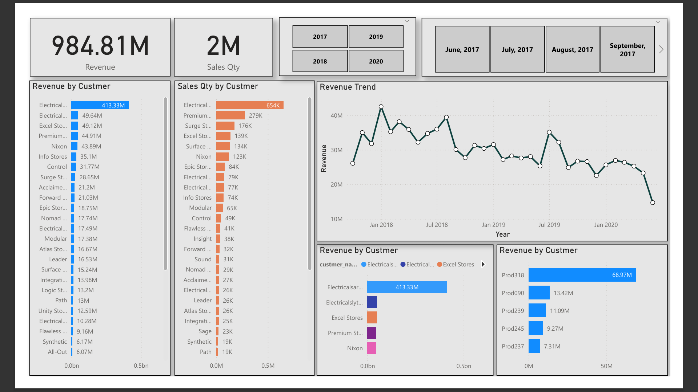

# Sales-Insight-Dashboard
Sales Dashboard project using SQL and Power BI, inspired by Codebasics. It visualizes key metrics like revenue and profit for business insights.

# 📊 1.-Sales-Insight-Dashboard

This repository contains a **Sales Dashboard** project created using **Power BI** and **SQL**, inspired by the tutorials from [Codebasics]. 
It visualizes key metrics like **total revenue, profit, customer segmentation**, and **product performance** for powerful business insights.

---

## 📌 Project Overview

The goal of this project is to analyze and visualize sales data by:
- Extracting and cleaning data using SQL
- Building interactive visualizations using Power BI

---

## 🔧 Tools & Technologies Used

- **Power BI** – For designing the interactive dashboard
- **SQL** – For querying and transforming the sales data
- **Codebasics YouTube Channel** – For project inspiration and guidance

---

## 📊 Dashboard Insights

The dashboard provides valuable insights into:

- 💰 **Total Sales & Profit**
- 🌍 **Region-wise Sales Distribution**
- 📆 **Monthly Sales Trends**
- 🛍️ **Product-wise Performance**
- 👥 **Customer Segmentation by Category**

---

## 🖼️ Dashboard Preview

---

## 📁 Files Included

- `Sales Insight DashBoard.pbix` – Power BI project file
- `db_dump.sql` – SQL queries and data scripts (if available)
- `Sales_Insight.png` – Dashboard image preview

---

## 🚀 How to Use

1. Clone or download the repository.
2. Open the `.pbix` file in Power BI Desktop.
3. Review the SQL queries and data files if included.
4. Explore the dashboard for interactive insights.

---

> 📅 Project created in August 2025  
> 🎓 Inspired by [Codebasics]
> 📌 Data is sample/fake and used for learning purposes only

---

Feel free to ⭐ star this repo or 🍴 fork it to build your own data analytics dashboard!
